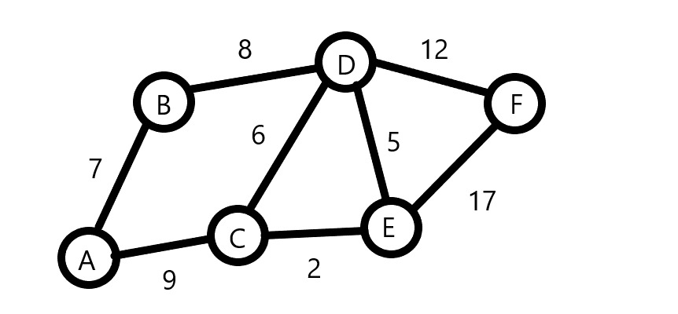
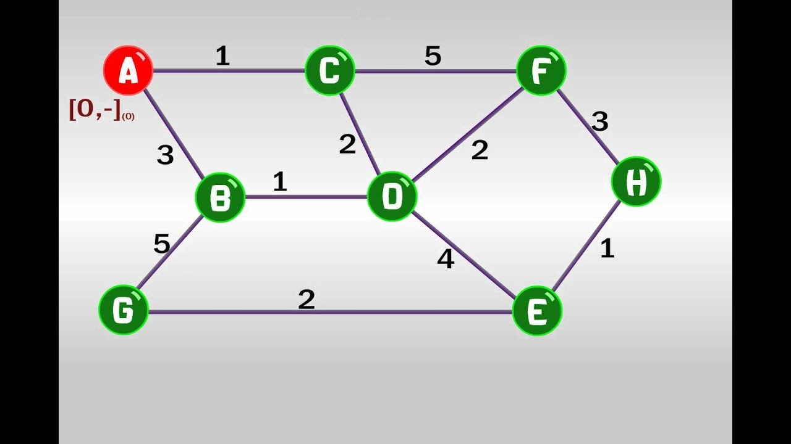
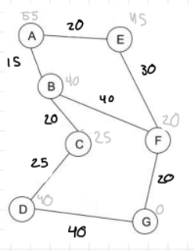

# TAREA 7 INTELIGENCIA ARTIFICIAL 🤖👨🏻‍💻
## ALUMNOS:
##### _GARCÍA FIGUEROA MUNGUÍA ALBERTO_
##### _GARCÍA GUTIÉRREZ EDGAR CRISTÓBAL_
##### _MORENO PERALTA ÁNGEL EDUARDO_

## ¿Qué se realizó? 📐🔨
En esta tarea se realizó la codificación de un que realiza el algoritmo de Dijkstra y A* 

## Ejecución 🖥🖱
Se requiere el uso de python 3.0.0 +
Se debe abrir una terminal en la ubicación de este readme y dependiendo de como se quiera correr el código se realizará lo siguiente:
### Ejecutar Programa como Usiario normal ###
```sh
python3 tarea7.py
```

### Ejecutar Pruebas Unitarias ###
Para ejecutar las pruebas se puede escribir cualquiera de los siguientes comandos
```sh
python3 test_tarea7.py
```
```sh
python3 -m unittest test_tarea7.py
```

GRAFO 1 PARA DIJKSTRA


GRAFO 2 PARA DIJKSTRA


GRAFO 1 PARA A*


GRAFO 2 PARA A*

